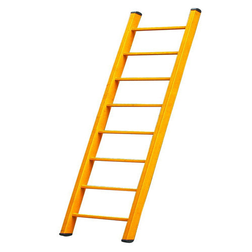

Nobody is ever skilled at anything in the beginning; it takes continuous practice and dedication to truly master a subject. To be honest, I never thought I would be interested in programming since I had a deep interest in electricity and circuits since the beginning of my high school years. It was not until I realized that a lot of software was required in various electrical components that got me interested in programming. I was a novice programmer going into the computer science field during my senior year of high school, starting off with programming in Java. It was almost like learning a new language because of the specific syntax I had to understand. Eventually, I began to settle into programming and grasp the concepts of syntax and program design, which allowed me to improve my skills in Java as well as incorporating them into other languages like C and C++. With interest in both electrical engineering and computer science, I have chosen the path of computer engineering where I will master my skills in both fields.
