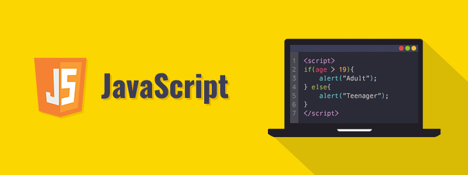

‎

## A Beginner

Learning a new language is always challenging as it often defies the rules of languages you previously knew. In this case, it is not a speaking language, but rather a computer language. JavaScript, as much as it sounds like Java, it is in fact a very foreign language to what I am used to. However, learning a new computer language has always been a fun experience for me so I was dedicated to learning JavaScript as much as I was dedicated to learning Java, C, or C++.

## Understanding the Language

JavaScript has many formats that are very similar to the other languages I am most familiar with, such as simple math operations, functions, or loops. But concepts like arrays, objects, or destructuring are slightly different and can be confusing for a beginner. I know that each language has its own benefits, like how JavaScript is beneficial for web development, so I cannot judge a programming language to be good nor bad. I believe I will enjoy using JavaScript as I get more familiar with the language because I would know what to do, but I am not enjoying it as much right now because of the fact that I am still a beginner to this language. I was able to understand the basics of JavaScript because I used my previous years of coding experience to help in my thought process of solving a coding problem, which allowed me to complete tasks in a short amount of time. However, heading into ES6 was almost like trying to learn a new language again. While it still has the syntax of JavaScript, it introduced many unfamiliar notations like destructuring, arrow functions, and array spreads. I am still not comfortable with ES6 and it will take time for me to truly understand how it works.

An effective way of learning is to always test yourself with a time constraint. This is where athletic softare engineering comes in because in the real world, there is always a time limit to complete a set of code. Being able to complete a program well and in a timely manner will prove that you truly understand how to code efficiently. While it can be stressful to run into compilation errors while having a timer next to you, I think that this is a way to improve yourself because you will know what you are good at and what you need to improve on. Athletic software engineering can be very enjoyable because it feels like a small competition to see how fast you are compared to others. If the completion time was exceptional, this feeling of success sparks joy within myself, giving me the motivation to continue on other challenges. 
