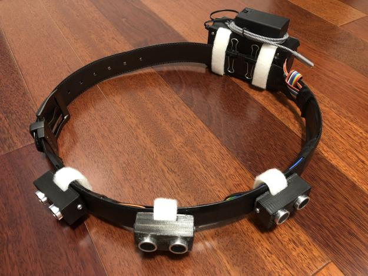

A device was created for the blind to improve their safety on the streets. Both the Time-of-Flight and the ultrasonic sensor were tested for accuracy and reliability. It was concluded that the ultrasonic sensors were more accurate and were chosen as the sensors on the final product. Three of these sensors output into an MP3 player and three vibration motors, attached onto a belt where the user can wear around the chest. After final modifications were made to the algorithm of the device, surveys and product testing were conducted on blind individuals. After testing the product, the device was able to detect objects in the blind person’s blind spot with a minimum error of 7.45% for the ultrasonic sensor, which showed that the device was able to improve safety and increase the reaction time towards different types of obstacles.

This was a year long project that I was committed to perfecting so I could improve my chances of advancing to the International Science and Engineering Fair (ISSEF). I used the Engineering Design Process to make sure my project best fit the audience. I modeled a prototype using infrared sensors and tested it with blind people at the Ho'opono Services for the Blind, using their feedback to construct a second model utilizing ultrasonic technology. To fully understand the differences between the two devices I made, I compared their accuracy by replicating real life scenarios a blind person may encounter. Upon completion of the project, it was recognized in the 62nd Hawaii State Science and Engineering Fair (HSSEF) but unfortunately, I was not able to advance to the International Science and Engineering Fair. 

After this project, I was able to learn a lot about circuits, programming, and design. With these skills, I was able to continue into my field of engineering to work on other projects. My social skills have also gotten better because I participated in three major presentations regarding this project: Moanalua High School Science Fair; Central District Fair; and the Hawaii State Science and Engineering Fair, all of which involved presenting to professionals and popular companies. 

You can learn more on [this website](https://ethancheez.github.io/STEM-Capstone-Project/) and check out the [GitHub Repo](https://github.com/ethancheez/STEM-Capstone-Project).

