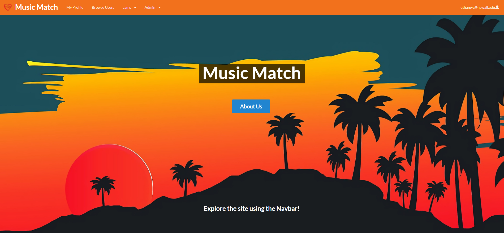
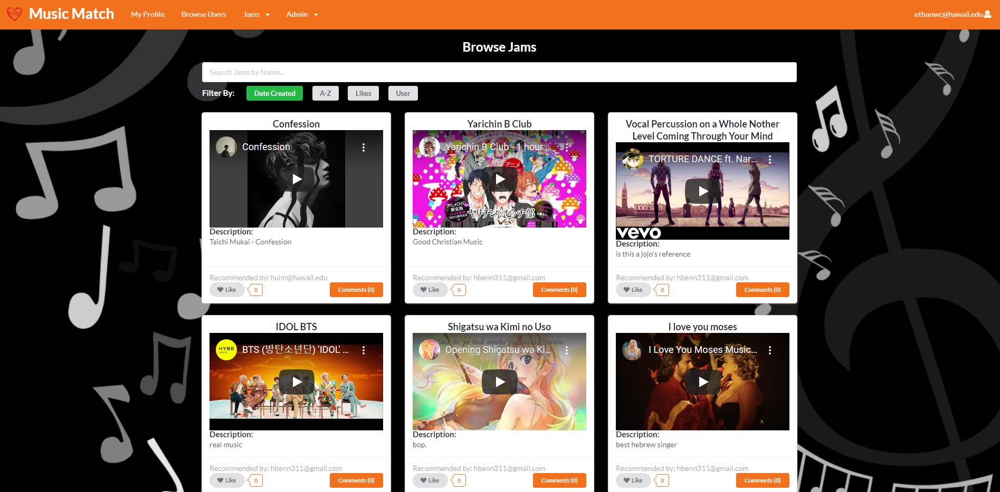

At the end of the Spring 2021 semester, it was finally time to merge all of my knowledge gained throughout the semester. Javascript, to HTML/CSS, to Semantic UI, to Semantic UI React, and finally Meteor. Everything I learned all in one major project. The Music Match project was a web application designed to allow students to upload their profile indicating their music interests, talents, and goals. Users can view other profiles and network with new friends with similar music interests. Additionally, users are able to share their favorite music, or "jams", for others to listen to.  

My main contributions towards this project involved the back end development and the final deployment of the site. This included implementing the functionality for the different collections in the database, profiles, and jams. Specifically, I created the profile and jams collections which allows users to create a profile and add jams to the site's database. I also integrated a music interest multi-select field within the profile which allowed users to pick multiple music interests from a set list. The jams included a like and comment feature so users can interact with each individual jam. For the front end development of the site, I was in charge of redesigning the landing page to make it more visually appealing. Upon receving feedback from multiple users, I made some minor adjustments to the site. I implemented new filters to the browse jam pages, allowing users to sort jams by the date created, alphabetical, number of likes, or by user.

The source code of the game can be found in this [GitHub Repo](https://github.com/music-match/music-match)
Our project page can be viewed [here](https://music-match.github.io/)
